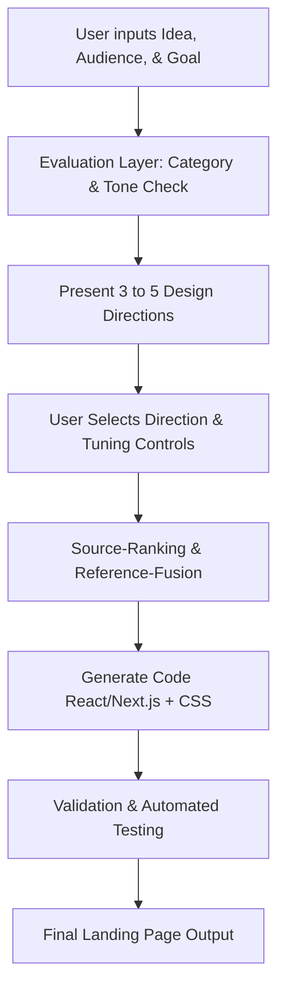

# Landing Page Generator Skill

A guided, creative AI assistant skill for generating highly polished, production-ready, and responsive React/Next.js landing pages. It guides the user from an initial product idea to a verified, pixel-perfect frontend using a curated selection of aesthetics, structured controls, component sourcing, and strict accessibility standards.

## Purpose & Scope

Use this skill when building or refactoring a web-based landing page, startup homepage, product marketing page, or developer tool index page. It combines design intelligence, motion engineering, and testing standards into a single automated generation workflow.

---

## 1. Inputs & Simple Tuning Controls

To keep the user experience clean and interactive, the skill gathers information through simple, non-technical prompts and exactly **five** curated tuning controls.

### Gathered Inputs
1. **Product Idea**: Description of what the product does.
2. **Target Audience**: Who the product is built for.
3. **Goal**: The primary action or conversion expected (e.g., signup, download, waitlist).

### Tuning Controls (1–5 Scale)
* **Creativity**: Controls the layout variety and visual boldness.
  * *Low (1)*: Standard, highly familiar layouts (classic hero + features grid).
  * *High (5)*: Asymmetric structures, overlaps, and layout-breaking visual elements.
* **Polish**: Controls the level of visual detail, overlays, and depth.
  * *Low (1)*: Flat design, sharp borders, minimal gradients.
  * *High (5)*: Glassmorphism overlays, mesh gradients, texture/grain overlays, custom shadows.
* **Motion**: Controls transition intensity and scroll-driven interactions.
  * *Low (1)*: Instant transitions or simple hover fades (prefers-reduced-motion friendly).
  * *High (5)*: Text reveals, scroll-triggered card fades, subtle parallax, and physical spring eases.
* **Density**: Controls spacing and content compactness.
  * *Low (1)*: High whitespace ("Ma" style), extremely open sections.
  * *High (5)*: Compact developer-console grid layout, high information density.
* **Accent Intensity**: Controls color saturation and brand presence.
  * *Low (1)*: Minimal monochrome with a single subtle accent indicator.
  * *High (5)*: Vibrant multi-gradient highlights, glowing borders, and colored backdrops.

---

## 2. Interactive User Flow

The skill operates in a step-by-step sequential cycle, verifying directions at each step:



### Phase 1: Input & Context Assessment
Gather the idea, audience, and goal. Immediately run the **Evaluation Layer** to verify compatibility before suggesting any layouts.

### Phase 2: Direction Proposal
Offer exactly **3 to 5 curated approaches** selected from the following catalog:
* **Clean SaaS**: Rounded corners, soft shadows, warm-toned cards, approachable modern layout.
* **Editorial Premium**: Serif headings, generous spacing, thin rules, caption-style text, high-contrast imagery.
* **Playful Startup**: Bold borders, squiggles, wiggles, bouncy hover effects, vibrant block colors (Neo-Memphis style).
* **Bold Futuristic**: Neon borders, glowing backgrounds, dark mode default, cybernetic grids, and particle-like motion.
* **Minimal Developer Tool**: Monospace typography, code blocks, flat boundaries, strict grids, high-density charts.

### Phase 3: Fine-Tuning
Apply the five simple tuning controls above to calibrate the chosen approach.

### Phase 4: Sourcing, Code Generation, and Verification
Select compatible libraries using the **Source-Ranking Step**, merge core rules via **Reference-Fusion**, write the components, and validate with automated testing.

---

## 3. Evaluation Layer & Aesthetic Compatibility Matrix

Before writing code or presenting directions, the agent evaluates the **Product Category** against the proposed **Aesthetic** to avoid mismatched design languages.

### Category-Aesthetic Suitability Matrix

| Product Category | Recommended Aesthetic | Acceptable Backups | Prohibited Aesthetics |
| :--- | :--- | :--- | :--- |
| **Developer Tools / Dev-Ops** | Minimal Developer Tool | Clean SaaS, Editorial | Playful Startup (feels unprofessional) |
| **B2B SaaS / Productivity** | Clean SaaS | Editorial Premium | Bold Futuristic (too distracting) |
| **Creative Agency / Luxury** | Editorial Premium | Minimal Developer Tool | Playful Startup (lacks sophistication) |
| **Consumer Apps / Social** | Playful Startup | Bold Futuristic, Clean SaaS | Minimal Developer Tool (too dry) |
| **Fintech / Cryptography** | Clean SaaS | Bold Futuristic, Editorial | Playful Startup (reduces trust) |
| **Web3 / AI Hardware** | Bold Futuristic | Clean SaaS, Minimal Dev Tool | Playful Startup (needs cutting-edge tone) |

### Suitability Evaluation Protocol
1. Classify the user's idea into a primary **Product Category**.
2. Cross-reference the category against the matrix above.
3. If the user overrides the recommended choice with a low-compatibility aesthetic, the skill output must present a **Warning Checkpoint** explaining the design risks (e.g., *"A Playful Startup aesthetic for a Dev-Ops security database may reduce user trust. Proceed anyway?"*).

---

## 4. Source-Ranking & Compatibility Matrix

To avoid creating a "collage of random effects" and mixing clashing libraries, the skill ranks open-source components according to style compatibility.

### Component Sourced Library Stack
* **Aceternity UI**: High-impact motion components, mesh grids, glowing cards, modern text effects.
* **Motion Primitives**: Smooth, modular Framer Motion components (layout slides, dialogs, micro-reveals).
* **SyntaxUI**: Creative layouts, grid items, responsive nav bars.
* **Spectrum UI / shadcn/ui**: Accessible base elements, structural primitives (inputs, buttons, forms).

### Source-Ranking Matrix by Aesthetic

| Aesthetic Direction | Primary Library | Secondary Library | Fallback Pattern |
| :--- | :--- | :--- | :--- |
| **Clean SaaS** | Motion Primitives | Spectrum UI / shadcn | Playwright standard component styling |
| **Editorial Premium** | Motion Primitives | SyntaxUI | Vanilla CSS + custom serif fonts |
| **Playful Startup** | SyntaxUI | Aceternity UI (bouncy) | Custom Tailwind custom outlines |
| **Bold Futuristic** | Aceternity UI | Motion Primitives | SVG canvases + custom border-glows |
| **Minimal Developer Tool** | Spectrum UI / shadcn | SyntaxUI (grids) | Monospace HTML standard elements |

### Source-Ranking Step Logic
* Rule 1: **Single-source interaction languages**: Do not combine two complex layout-altering animation engines. Use `framer-motion` (via Motion Primitives / Aceternity) as the single driver of interactive layout shifts.
* Rule 2: **Border/Radius Continuity**: Match rounding rules. Clean SaaS uses `rounded-xl` (12px); Developer tools use `rounded-none` or `rounded-sm` (4px); Playful uses bold `rounded-2xl` (16px) with `border-2 border-black`. Do not mix them in a single generation.
* Rule 3: **No overlapping canvases**: Only one component with active canvas animation (e.g., interactive backgrounds, floating particles) is allowed per page, and it must reside in the hero section.

---

## 5. Reference-Fusion Rules

Extracted from UI-UX Pro Max, Vercel Web Interface Guidelines, AccessLint accessibility rules, React Best Practices, and Bencium UX.

### 5.1. Accessibility & AccessLint Rules (HIGHEST PRIORITY)
* **Contrast Safeguard**: All text elements (including captions and input placeholders) must maintain a minimum WCAG 2.1 AA contrast ratio of **4.5:1** against backgrounds (3:1 for text larger than 24px).
* **Keyboard Nav & Focus Outline**: Interactive elements (`button`, `a`, `input`, custom selectors) must have a visible, high-contrast focus ring (e.g., `focus-visible:ring-2 focus-visible:ring-primary focus-visible:outline-none`). Do not hide focus rings.
* **Screen Reader Metadata**:
  * Every image must have a descriptive `alt` attribute.
  * Every icon-only button must have an `aria-label` or `aria-labelledby` property.
  * Form inputs must be linked to `<label>` tags using `htmlFor`.
* **Reduced Motion Compliance**: Wrap all animation components in standard media-query checking or Framer Motion hooks:
  ```tsx
  // In React Components:
  const shouldReduceMotion = useReducedMotion();
  const transition = shouldReduceMotion ? { duration: 0 } : { type: "spring", stiffness: 300 };
  ```
  In plain Tailwind: use `motion-safe:` prefixes for animations and transitions (e.g., `motion-safe:hover:scale-105 transition-transform`).

### 5.2. Vercel-Style Web Design & Composition Rules
* **Borders over Shadows**: Rely on crisp 1px borders (`border-neutral-200` in light, `border-neutral-800` in dark) rather than heavy drop shadows to define boundaries and layout hierarchy.
* **Layout and Alignment**:
  * Use strict grid and flex layout systems. Avoid absolute positioning unless creating background decorations.
  * Keep content widths contained. Set comfortable max-widths (e.g., `max-w-7xl px-4 sm:px-6 lg:px-8`).
* **Interactive States**: Every interactive element must transition between states smoothly (`duration-150 ease-in-out` on hover, active, focus, and disabled states). Never use default browser button behaviors without styling.
* **Semantic HTML**: Mark up sections using `<header>`, `<main>`, `<section>`, `<article>`, `<footer>` instead of nested `<div>`s.

### 5.3. React & Composition Best Practices
* **Component Composition**: Prefer using the `children` prop and composable layouts over monolithic components.
* **Strict Prop Interface**: All component props must be typed cleanly using TypeScript interfaces.
* **Zero Layout Shift (CLS)**: Set explicit height/width attributes on image placeholders or use Next.js `next/image` to prevent layout shifts.

---

## 6. Sourcing & Coding Guidelines

### Fallback Path
When the confidence is low (e.g., dependencies are missing, or chosen animations fail typescript compilation), the generator must immediately fall back to a **Standard Vanilla Tailwind + HTML semantic template** matching the chosen aesthetic. It must avoid using complex library features that could throw runtime errors.

### Code Constraints
* Use Tailwind CSS for styles, paired with CSS variables for the color system.
* Use React Lucide (`lucide-react`) for icons.
* Use `framer-motion` for motion-critical features, conforming to the **Reduced Motion** rule.

---

## 7. Validation & Automated Testing

Every generated page must undergo three verification stages before completion:

1. **Unit Tests (React Testing Library)**:
   * Verify all critical buttons and call-to-actions (CTAs) render correctly.
   * Check that state transitions (e.g., waitlist signup submit showing success state) work.
2. **Integration Tests (AccessLint/A11y)**:
   * Programmatic validation of HTML markup to check for duplicate `id`s, missing `alt` attributes, and lack of focus rings.
3. **Smoke Tests (Playwright / Puppeteer)**:
   * Verify page loads without console errors.
   * Assert responsive viewport switches (375px mobile, 768px tablet, 1440px desktop) do not trigger horizontal scrolling.

---

## 8. Suggested Folder Structure

Place assets, components, and tests according to this layout:

```
.agents/skills/landing-page-generator/
├── SKILL.md                          # This specification file
├── templates/
│   ├── clean-saas.tsx                # Base Clean SaaS component structure
│   ├── editorial.tsx                 # Base Editorial component structure
│   ├── developer-tool.tsx            # Base Dev Tool component structure
│   └── bold-futuristic.tsx           # Base Futuristic component structure
├── scripts/
│   ├── a11y-validator.js            # Node script for AccessLint-style analysis
│   └── bundle-checker.js            # Script to verify component imports
└── examples/
    └── sample-brief.md               # Example design brief and tuning inputs
```

---

## 9. Failure Handling & Recovery Protocols

If the generation fails or produces unexpected visual artifacts:
1. **Lint Errors**: Re-run the compile step, identify imports that are missing or mismatched, and substitute them with standard React primitives.
2. **A11y Violations**: If the contrast fails, automatically increase contrast by sliding color variables towards pure black (`#000000`) or white (`#FFFFFF`).
3. **Responsive Break**: If horizontal scrolling is detected at 375px viewports, find components utilizing hard-coded width pixel bounds (`w-[500px]`) and replace them with percentages or flex containers (`w-full max-w-md`).

---

## 10. Sample Prompts & Execution Guidelines

### Shorter "System Prompt" Version (For Agent Systems)
```
You are the Landing Page Generator Agent. Your task is to guide the user in translating a product idea into a production-grade React/Next.js landing page. 
Always follow these stages:
1. Gather Idea, Target Audience, and Goal.
2. Run the Aesthetic Evaluation Layer to find the optimal design style (Clean SaaS, Editorial, Playful, Bold Futuristic, Minimal Dev Tool).
3. Present 3 to 5 design directions and ask for tuning values (Creativity, Polish, Motion, Density, Accent).
4. Apply the Source-Ranking Matrix and Reference-Fusion rules (combining UI-UX Pro Max, Vercel Web Guidelines, and AccessLint).
5. Generate the React/Next.js page using clean, composable components.
6. Verify code with unit/smoke/accessibility tests.
Always prioritize accessibility: contrast >= 4.5:1, visible focus rings, and prefers-reduced-motion triggers.
```

### Developer Prompt Version (For AI Pair Programming)
```
You are a senior frontend developer and AI workflow designer. Initialize the landing-page-generator skill process.
Read the target codebase to understand existing styling variables, Tailwind configurations, and UI dependencies.
Create a design brief that classifies the product category, evaluates aesthetic compatibility, and selects component candidates from Aceternity UI, Motion Primitives, or Spectrum UI.
Apply the five simple tuning controls: Creativity, Polish, Motion, Density, and Accent Intensity.
Enforce Vercel-style web guidelines (borders over shadows, 1px rules, smooth interactive states) and AccessLint validation.
Generate clean React/Next.js code containing all layout structure, styled components, and dynamic transitions. Include unit tests and responsive verification.
```

### Sample End-User Prompt (For Creating a Landing Page)
```
Use the landing-page-generator skill to create a landing page for my new product.
- Product Idea: A desktop database client that lets developers write SQL queries using natural language and visualizes data relationships automatically.
- Target Audience: Developers, database administrators, and data analysts who want to work faster without writing complex JOINs manually.
- Goal: Get developers to sign up for our early beta waitlist.

Please present the recommended design directions and ask me to choose, then let me configure the 5 tuning controls.
```
